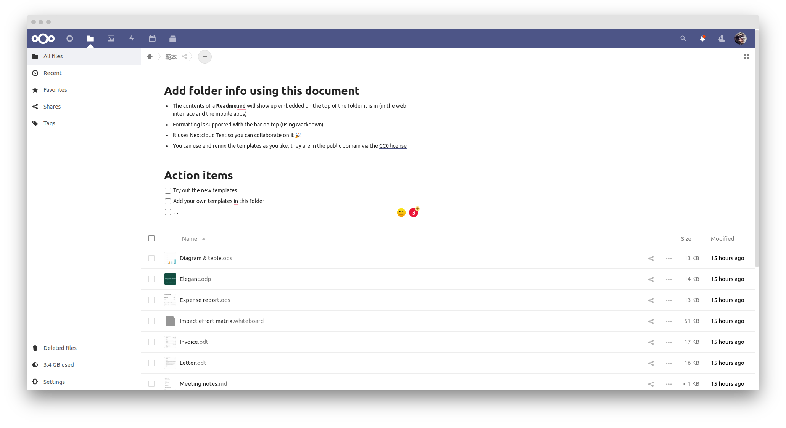
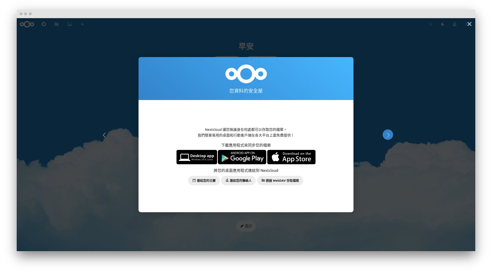
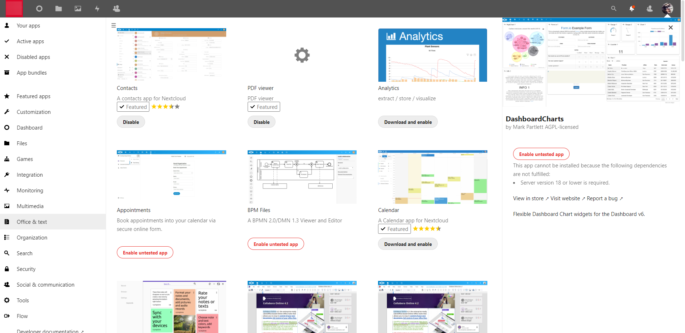
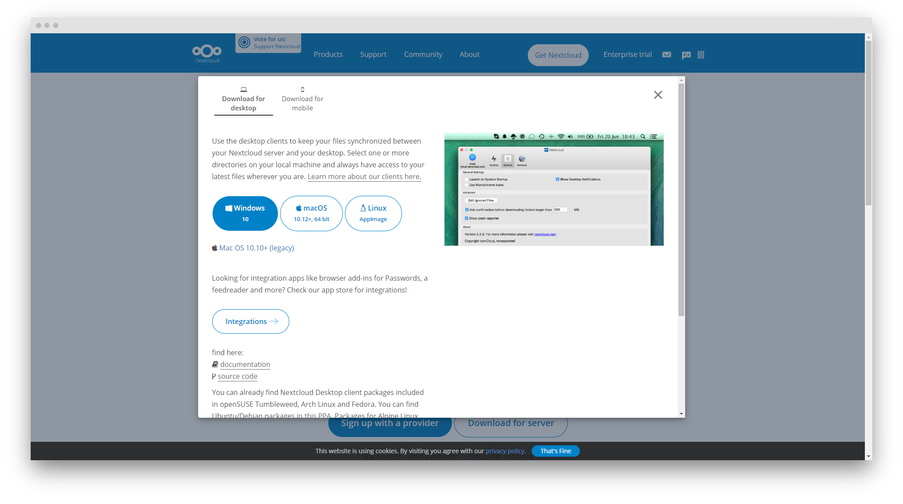
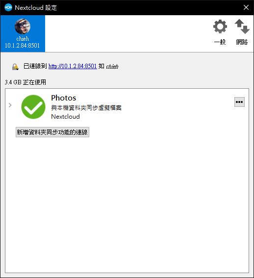
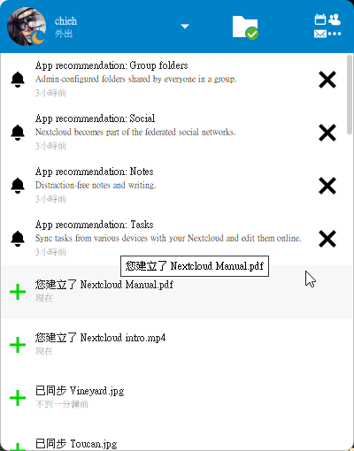
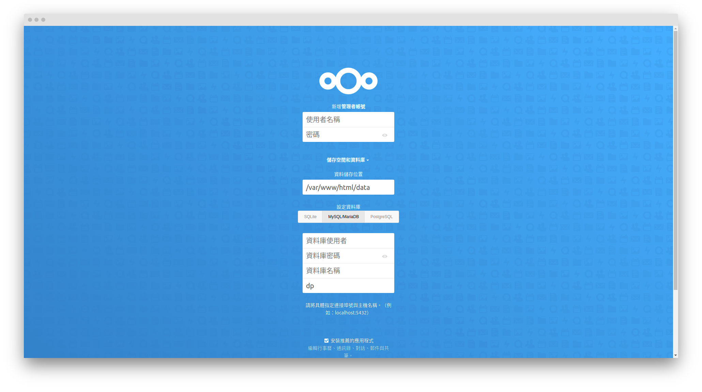

# Nextcloud 

In this repo, I will introduce the nextcloud, and showcase how to set up steps.

## Feature introduction

You can give some descriptions for each folder.

They provide many platforms to let you choose such as WIN, macOS, linux, android, and ios.

You can imagine that one is like what we are using Google drive.

In addition, they provide a lot of applications inside that you can install it and enable those plug-in. We can notice that it includes various categories.

## Download app

From : https://nextcloud.com/install/

It supports many platforms including WIN, macOS, Linux, Android, and IOS, so you can choose the OS what you use. It is very convenient that I used to upload a file or image from my phone, and download or backup it on my desktop.

### WIN System

after we download and follow the installation steps, we can open it and sync the files (you can choose). I think it is very very powerful!!

We can set more detail part about Synchronizing the files or folders, etc.

You can find the controller in the right-down area.
Here will show everything about the status like Google drive.

---
# Installation
## Set the DB and your admin account
When you log in initially, you have to set what kind of database you wanna use. If you just wanna try for fun, you can directly choose the **SQLite**. This one does not request to particularly build a database.
However, if you wanna maintain for a long term use, it is better to proivde a formal database for nextcloud. Hence, I provide a [docker-compose](./docker-compose.yml) file to demonstrate how to connect it.

1. Create a folder name: `db` 
2. Modify the info such as password, account name or port in this docker compose file.
3. use the command `docker-compose up -d` to start it.

**NOTE:** choose the `MySQL` this one, and fill in the database username / database password / database name. Especially, the last one just fills in the `db`. That's all. 

Done!

>If you wanna see detail setting about functionality, you can check [here](./Adjust-detail-setting.md).

## Reference
- [This is a chinese article that it shows how to rapidly build one Nextcloud via one commnad](https://zhuanlan.zhihu.com/p/108301496)
- [Use docker-compose file to start the nextcloud](https://zhuanlan.zhihu.com/p/107820215)